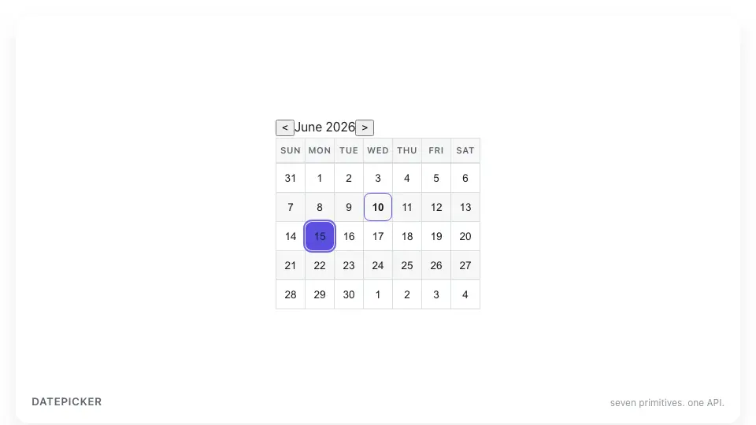

<div align="center">

<picture>
  <source media="(prefers-color-scheme: dark)" srcset="./img/hero-dark.webp">
  
</picture>

# Kalyx

**마침내 완성된 Headless React DatePicker.**

[문서](https://kalyx-docs-site.vercel.app/ko) · [English](https://kalyx-docs-site.vercel.app) · [npm](https://www.npmjs.com/package/@kalyx/react) · [README.md](./README.md)

[](https://www.npmjs.com/package/@kalyx/react)
[](https://www.npmjs.com/package/@kalyx/react?activeTab=versions)
[](https://kalyx-docs-site.vercel.app/ko/docs/api/react#bundle-size)
[](https://www.typescriptlang.org/)
[](https://react.dev/)
[](./LICENSE)

</div>

---

Kalyx는 **완결된 채로** 배포되는 Headless React DatePicker 라이브러리입니다. 단일 날짜 / 범위 / 시간 / 날짜+시간 / 월 / 연 / 주 7종 픽커를 하나의 조합형 API로 다룹니다 — gzip ~15 KB (≤ 16 KB), CSS 없음, SSR 안전.

```bash
pnpm add @kalyx/react
```

> **v1.0 RC를 시도?** `pnpm add @kalyx/react@rc` — 이슈는 [`v1-rc`](https://github.com/jiji-hoon96/kalyx/issues?q=label%3Av1-rc) 라벨로.

```tsx
import { DatePicker } from '@kalyx/react';

<DatePicker value={iso} onChange={setIso}>
  <DatePicker.Input />
  <DatePicker.Popover>
    <DatePicker.Calendar />
  </DatePicker.Popover>
</DatePicker>
```

`onChange`는 항상 `ISODateString | null` — UTC 안전, `Date` 객체 없음.

## Kalyx를 쓰는 이유

2026년 React 데이트 피커 시장은 둘 중 하나를 강요한다: 통합됐지만 무거운 것(react-datepicker ~62 KB, MUI ~45 KB), 또는 가볍지만 부분적인 것(react-day-picker · react-aria · ark-ui — calendar grid만). react-calendar는 단일 날짜·범위는 다루지만 time·RSC·timezone 저장이 빠지고, react-native-calendars는 모바일 우선이다.

Kalyx는 **7개 프리미티브** — 단일 날짜, 범위, 시간, 날짜+시간, 월, 연, 주 — 를 하나의 composition API로 묶는다. Headless, ~15 KB gzip, SSR 안전, ISO 문자열 입출력, date-fns/dayjs/luxon용 adapter 패턴.

[전체 비교 표 →](https://kalyx-docs-site.vercel.app/ko/docs/comparison)

## 특징

- **Zero CSS** — 임포트할 스타일시트도, 재정의할 클래스도 없음.
- **Composition API** — Radix 스타일 dot 표기. props 폭발 없음.
- **SSR 안전** — Next.js App Router 검증.
- **ISO 8601 UTC 문자열** — `Date` 객체의 함정 없음.
- **IANA 타임존** — `displayTimezone`이 DST·civil day 처리, 저장 계약은 UTC.
- **접근성** — WAI-ARIA + 풀 키보드, axe 자동 통과.
- **트리셰이킹** — `sideEffects: false`. 임포트한 만큼만 비용.
- **TypeScript strict** — `any` 없음.

## 패키지

| 패키지 | 역할 |
|---|---|
| [`@kalyx/react`](./packages/react) | React 컴포넌트·훅·타입 |
| [`@kalyx/core`](./packages/core) | 플랫폼 독립 날짜 로직·어댑터 |

## 컴포넌트

7개 조합형 픽커 + 3개 headless 훅:

```tsx
import {
  DatePicker, RangePicker, TimePicker, DateTimePicker,
  MonthPicker, YearPicker, WeekPicker,
  useDatePicker, useRangePicker, useTimePicker,
} from '@kalyx/react';
```

API 레퍼런스, 레시피 (Tailwind / shadcn / React Hook Form), 마이그레이션 가이드는 모두 **[공식 문서](https://kalyx-docs-site.vercel.app/ko)** 에 있습니다.

## 문서

- [소개](https://kalyx-docs-site.vercel.app/ko/docs/intro) · [빠른 시작](https://kalyx-docs-site.vercel.app/ko/docs/getting-started/quick-start)
- [컴포넌트](https://kalyx-docs-site.vercel.app/ko/docs/components/datepicker) · [훅](https://kalyx-docs-site.vercel.app/ko/docs/hooks/use-date-picker)
- [레시피](https://kalyx-docs-site.vercel.app/ko/docs/recipes/tailwind) · [테스트](https://kalyx-docs-site.vercel.app/ko/docs/recipes/testing) · [문제 해결](https://kalyx-docs-site.vercel.app/ko/docs/troubleshooting)
- [마이그레이션 (react-datepicker / react-day-picker / React Aria)](https://kalyx-docs-site.vercel.app/ko/docs/migration)

## 번들

`@kalyx/react` v1.0.0 → **15.63 KB** gzip (ESM) / **15.76 KB** (CJS). CI 한계 ≤ 16 KB.

## 지원 환경

React 19+ · 모든 모던 브라우저 · SSR: Next.js App Router / Pages Router / Remix · Node ≥ 20.

## 기여

```bash
pnpm install
pnpm test            # 단위 + 컴포넌트
pnpm typecheck
pnpm lint
pnpm build
pnpm check-bundle    # ≤ 16 KB
```

아키텍처 원칙은 [CLAUDE.md](./CLAUDE.md) 참고.

## 라이선스

[MIT](./LICENSE) © 2026 Kalyx contributors.
